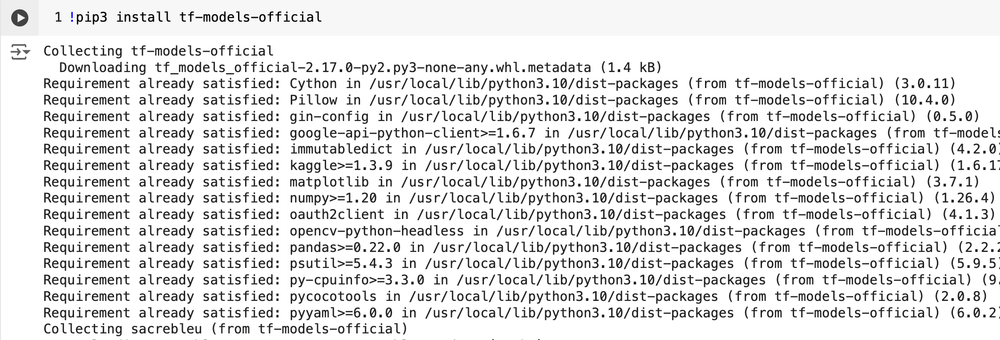

tensorflow圖形檢測_使用Google Colab使用Tensorflow進行自定義對象檢測
--------------------------------------------------------------------
#### 跨領域-人工智慧期中報告 組員:11124110 高儒彥 11124136 王何儀

## 摘要
本報告旨在介紹如何在 Google Colab 環境中使用 TensorFlow 物件偵測 API 來構建自定義物件偵測器。我們將以蘋果圖像為範例，演示自定義對象檢測的流程，包含環境設定、資料蒐集與標註、模型訓練等主要步驟。報告內容涵蓋以下幾個主要步驟：

1. 環境安裝與設定
2. 數據集收集與標註
3. TFRecords 格式生成
4. 訓練模型配置與運行
5. 模型訓練與檢測測試
6. 推論圖生成與應用

設定Google Colab環境
------------------------------
確保您有Python 3.6或更高版本

tf-models-official 是穩定的 Model Garden 包

pip3 將自動安裝所有模型和依賴項。
```
!pip3 install tf-models-official
```


如果您有可與 Tensorflow 一起使用的 GPU:
```
pip install tensorflow-gpu
```
*Other dependencies*
```
!sudo apt-get install protobuf-compiler python3-pil python3-lxml python3-tk git
!pip3 install pillow Cython lxml jupyter matplotlib contextlib2
!pip3 install --user -r models/official/requirements.txt
!pip install tensorflow-io
!pip3 install pycocotools
```
複製TensorFlow模型倉庫運行以下程式碼，克隆```TensorFlow```模型庫並進入```research```目錄：
```
!git clone https://github.com/tensorflow/models.git
```
Protobuf編譯
-------------
Protobuf編譯: Tensorflow物件偵測API使用Protobufs配置模型和訓練參數。在使用該框架之前，必須先編譯Protobuf函式庫。這應該透過從tensorflow / models / research /目錄執行以下命令來完成：


克隆 tf models 儲存庫後，現在轉到research資料夾
```
%cd models/research
```
```
# From tensorflow/models/research/
!protoc object_detection/protos/*.proto --python_out=.
```
將庫加入到PYTHONPATH在google colab運行時，應將TFmodels / research /和slim目錄附加到PYTHONPATH(使用 os.environ 設定 Python 路徑)
```
# From tensorflow/models/research/
import os
os.environ['PYTHONPATH'] += ":/content/drive/MyDrive/113-ai/models/research:/content/drive/MyDrive/113-ai/models/research/slim"
```
### *note :*
該命令需要從您啟動的每個新終端運行。如果您希望避免手動運行它，可以將其作為新行添加到 ~/.bashrc 檔案的末尾，將 pwd 替換為系統上的 tensorflow/models/research 的絕對路徑


物體偵測安裝&測試安裝
---------------
```
!pip install tf-slim

# 測試物件偵測 API 是否正確安裝
!python object_detection/builders/model_builder_tf2_test.py
```

Gathering data
-------------------------
2.1 開啟您的google chrome瀏覽器並安裝一個名為Download All Images的擴充功能。


2.2 現在在Google圖片中搜尋所需的圖片選擇，在我的例子中是「 Apple」。現在，按一下「下載所有圖像」擴充功能按鈕，該按鈕將位於瀏覽器的右上角。您將獲得一個包含圖像的zip檔。然後將其提取。
